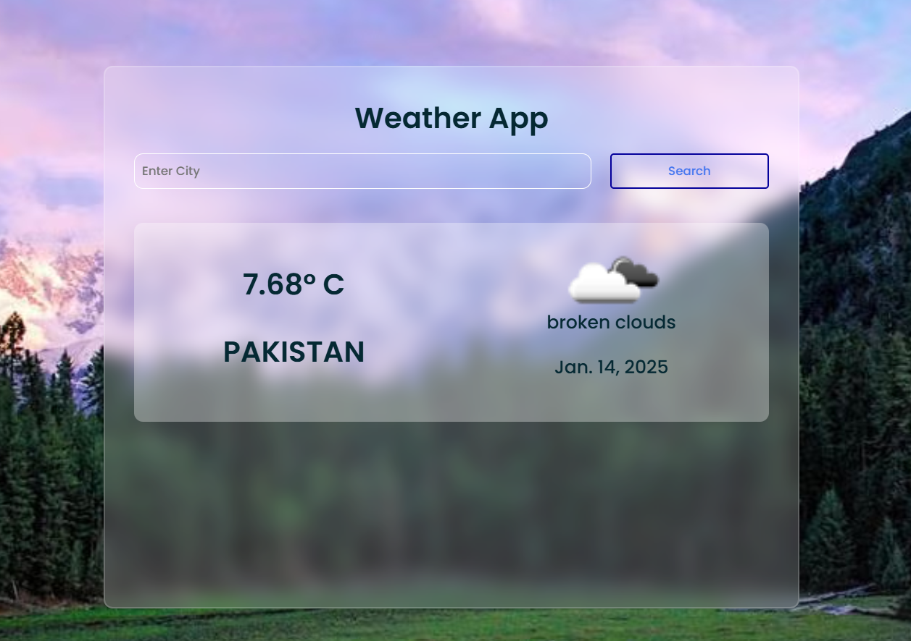

# Weather App

A Django-based web application that provides real-time weather information for any city, along with a dynamic background image related to the city.

## Installation

### Prerequisites
- Python 3.x
- Django

### Steps
1. Clone the repository:
   ```bash
   git clone https://github.com/yourusername/weather-app.git
   ```
2. Navigate to the project directory:
   ```bash
   cd weather-app
   ```
3. Install the required dependencies:
   ```bash
   pip install -r requirements.txt
   ```
4. Set up environment variables for API keys:
   - Create a `.env` file in the root directory.
   - Add the following lines to the `.env` file:
     ```
     OPENWEATHERMAP_API_KEY=your_openweathermap_api_key
     GOOGLE_CUSTOM_SEARCH_API_KEY=your_google_custom_search_api_key
     GOOGLE_CUSTOM_SEARCH_ENGINE_ID=your_google_custom_search_engine_id
     ```

## Usage

1. Run the development server:
   ```bash
   python manage.py runserver
   ```
2. Access the application in your browser at `http://localhost:8000`.
3. Enter a city name in the search bar to view weather information and a related background image.

## File Structure

- `weatherapp/views.py`: Handles the logic for fetching weather data and images.
- `weatherapp/templates/weatherapp/index.html`: The main template for the frontend interface.
- `static/style.css`: Stylesheet for the application.
- `weatherproject/settings.py`: Django settings file.

## Contributing

Contributions are welcome! Please follow these steps:
1. Fork the repository.
2. Create a new branch for your feature or bugfix.
3. Commit your changes.
4. Submit a pull request.

## License

This project is licensed under the MIT License. See the `LICENSE` file for details.
